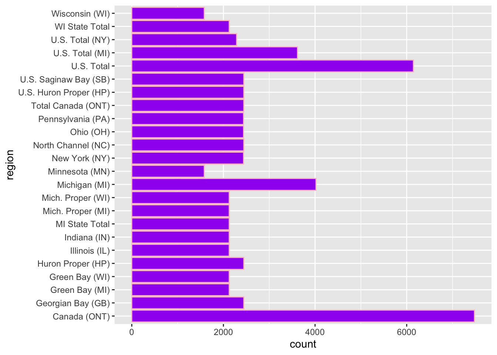

## Fish

## Running Code

When you click the **Render** button a document will be generated that includes both content and the output of embedded code. You can embed code like this:


::: {.cell}

```{.r .cell-code}
#Load the tidyverse
library(tidyverse)
```

::: {.cell-output .cell-output-stderr}
```
── Attaching packages ─────────────────────────────────────── tidyverse 1.3.2 ──
✔ ggplot2 3.4.0      ✔ purrr   1.0.0 
✔ tibble  3.1.8      ✔ dplyr   1.0.10
✔ tidyr   1.2.1      ✔ stringr 1.5.0 
✔ readr   2.1.3      ✔ forcats 0.5.2 
── Conflicts ────────────────────────────────────────── tidyverse_conflicts() ──
✖ dplyr::filter() masks stats::filter()
✖ dplyr::lag()    masks stats::lag()
```
:::

```{.r .cell-code}
library(kableExtra)
```

::: {.cell-output .cell-output-stderr}
```

Attaching package: 'kableExtra'

The following object is masked from 'package:dplyr':

    group_rows
```
:::
:::


You can add options to executable code like this


::: {.cell}

```{.r .cell-code}
fishing <- readr::read_csv('https://raw.githubusercontent.com/rfordatascience/tidytuesday/master/data/2021/2021-06-08/fishing.csv')
```

::: {.cell-output .cell-output-stderr}
```
Rows: 65706 Columns: 7
── Column specification ────────────────────────────────────────────────────────
Delimiter: ","
chr (4): lake, species, comments, region
dbl (3): year, grand_total, values

ℹ Use `spec()` to retrieve the full column specification for this data.
ℹ Specify the column types or set `show_col_types = FALSE` to quiet this message.
```
:::

```{.r .cell-code}
stocked <- readr::read_csv('https://raw.githubusercontent.com/rfordatascience/tidytuesday/master/data/2021/2021-06-08/stocked.csv')
```

::: {.cell-output .cell-output-stderr}
```
Warning: One or more parsing issues, call `problems()` on your data frame for details,
e.g.:
  dat <- vroom(...)
  problems(dat)
```
:::

::: {.cell-output .cell-output-stderr}
```
Rows: 56232 Columns: 31
── Column specification ────────────────────────────────────────────────────────
Delimiter: ","
chr (17): LAKE, STATE_PROV, SITE, ST_SITE, STAT_DIST, LS_MGMT, SPECIES, STRA...
dbl (14): SID, YEAR, MONTH, DAY, LATITUDE, LONGITUDE, GRID, NO_STOCKED, YEAR...

ℹ Use `spec()` to retrieve the full column specification for this data.
ℹ Specify the column types or set `show_col_types = FALSE` to quiet this message.
```
:::
:::


The `echo: false` option disables the printing of code (only output is displayed).


::: {.cell}

```{.r .cell-code}
#install.packages("tidymodels")
library(tidymodels)
```

::: {.cell-output .cell-output-stderr}
```
── Attaching packages ────────────────────────────────────── tidymodels 1.0.0 ──
```
:::

::: {.cell-output .cell-output-stderr}
```
✔ broom        1.0.2     ✔ rsample      1.1.1
✔ dials        1.1.0     ✔ tune         1.0.1
✔ infer        1.0.4     ✔ workflows    1.1.2
✔ modeldata    1.1.0     ✔ workflowsets 1.0.0
✔ parsnip      1.0.3     ✔ yardstick    1.1.0
✔ recipes      1.0.4     
```
:::

::: {.cell-output .cell-output-stderr}
```
── Conflicts ───────────────────────────────────────── tidymodels_conflicts() ──
✖ scales::discard()        masks purrr::discard()
✖ dplyr::filter()          masks stats::filter()
✖ recipes::fixed()         masks stringr::fixed()
✖ kableExtra::group_rows() masks dplyr::group_rows()
✖ dplyr::lag()             masks stats::lag()
✖ yardstick::spec()        masks readr::spec()
✖ recipes::step()          masks stats::step()
• Dig deeper into tidy modeling with R at https://www.tmwr.org
```
:::

```{.r .cell-code}
my_data_splits <- initial_split(fishing, prop = 0.5)

exploratory_data <- training(my_data_splits)
test_data <- testing(my_data_splits)
```
:::


# About Our Data

This data includes 5 main variables of the fishing data set regarding the 51 Great Lakes fish species observed. The variables include year of measurement, species of fish, region of the U.S, lake name, and grand total of observed.

# Interesting Questions to ask

-   Which lake has the most variety of species?

-   Will the species of fish change in each region every year?

-   How many of each species do we have? by region?

# Hypothesis

-   I hypothesize the average number of species will increase by year

-   I hypothesize the average number of species per lake will increase by year.

<!-- -->

This table shows the number of observed species. There are 51 species.


::: {.cell}

```{.r .cell-code}
exploratory_data %>%
  count(species)
```

::: {.cell-output .cell-output-stdout}
```
# A tibble: 51 × 2
   species          n
   <chr>        <int>
 1 Alewife        264
 2 Amercian Eel   130
 3 American Eel    26
 4 Blue Pike      370
 5 Bowfin         184
 6 Buffalo        226
 7 Bullhead        24
 8 Bullheads     1205
 9 Burbot        1214
10 Carp          1565
# … with 41 more rows
```
:::
:::

::: {.cell}

```{.r .cell-code}
#install.packages("skimr")
library(skimr)
exploratory_data %>%
  skim()
```

::: {.cell-output-display}
<table style='width: auto;'
      class='table table-condensed'>
<caption>Data summary</caption>
<tbody>
  <tr>
   <td style="text-align:left;"> Name </td>
   <td style="text-align:left;"> Piped data </td>
  </tr>
  <tr>
   <td style="text-align:left;"> Number of rows </td>
   <td style="text-align:left;"> 32853 </td>
  </tr>
  <tr>
   <td style="text-align:left;"> Number of columns </td>
   <td style="text-align:left;"> 7 </td>
  </tr>
  <tr>
   <td style="text-align:left;"> _______________________ </td>
   <td style="text-align:left;">  </td>
  </tr>
  <tr>
   <td style="text-align:left;"> Column type frequency: </td>
   <td style="text-align:left;">  </td>
  </tr>
  <tr>
   <td style="text-align:left;"> character </td>
   <td style="text-align:left;"> 4 </td>
  </tr>
  <tr>
   <td style="text-align:left;"> numeric </td>
   <td style="text-align:left;"> 3 </td>
  </tr>
  <tr>
   <td style="text-align:left;"> ________________________ </td>
   <td style="text-align:left;">  </td>
  </tr>
  <tr>
   <td style="text-align:left;"> Group variables </td>
   <td style="text-align:left;"> None </td>
  </tr>
</tbody>
</table>


**Variable type: character**

<table>
 <thead>
  <tr>
   <th style="text-align:left;"> skim_variable </th>
   <th style="text-align:right;"> n_missing </th>
   <th style="text-align:right;"> complete_rate </th>
   <th style="text-align:right;"> min </th>
   <th style="text-align:right;"> max </th>
   <th style="text-align:right;"> empty </th>
   <th style="text-align:right;"> n_unique </th>
   <th style="text-align:right;"> whitespace </th>
  </tr>
 </thead>
<tbody>
  <tr>
   <td style="text-align:left;"> lake </td>
   <td style="text-align:right;"> 0 </td>
   <td style="text-align:right;"> 1.00 </td>
   <td style="text-align:right;"> 4 </td>
   <td style="text-align:right;"> 11 </td>
   <td style="text-align:right;"> 0 </td>
   <td style="text-align:right;"> 6 </td>
   <td style="text-align:right;"> 0 </td>
  </tr>
  <tr>
   <td style="text-align:left;"> species </td>
   <td style="text-align:right;"> 0 </td>
   <td style="text-align:right;"> 1.00 </td>
   <td style="text-align:right;"> 4 </td>
   <td style="text-align:right;"> 29 </td>
   <td style="text-align:right;"> 0 </td>
   <td style="text-align:right;"> 51 </td>
   <td style="text-align:right;"> 0 </td>
  </tr>
  <tr>
   <td style="text-align:left;"> comments </td>
   <td style="text-align:right;"> 30086 </td>
   <td style="text-align:right;"> 0.08 </td>
   <td style="text-align:right;"> 3 </td>
   <td style="text-align:right;"> 607 </td>
   <td style="text-align:right;"> 0 </td>
   <td style="text-align:right;"> 161 </td>
   <td style="text-align:right;"> 0 </td>
  </tr>
  <tr>
   <td style="text-align:left;"> region </td>
   <td style="text-align:right;"> 0 </td>
   <td style="text-align:right;"> 1.00 </td>
   <td style="text-align:right;"> 9 </td>
   <td style="text-align:right;"> 22 </td>
   <td style="text-align:right;"> 0 </td>
   <td style="text-align:right;"> 24 </td>
   <td style="text-align:right;"> 0 </td>
  </tr>
</tbody>
</table>


**Variable type: numeric**

<table>
 <thead>
  <tr>
   <th style="text-align:left;"> skim_variable </th>
   <th style="text-align:right;"> n_missing </th>
   <th style="text-align:right;"> complete_rate </th>
   <th style="text-align:right;"> mean </th>
   <th style="text-align:right;"> sd </th>
   <th style="text-align:right;"> p0 </th>
   <th style="text-align:right;"> p25 </th>
   <th style="text-align:right;"> p50 </th>
   <th style="text-align:right;"> p75 </th>
   <th style="text-align:right;"> p100 </th>
   <th style="text-align:left;"> hist </th>
  </tr>
 </thead>
<tbody>
  <tr>
   <td style="text-align:left;"> year </td>
   <td style="text-align:right;"> 0 </td>
   <td style="text-align:right;"> 1.00 </td>
   <td style="text-align:right;"> 1954.61 </td>
   <td style="text-align:right;"> 38.64 </td>
   <td style="text-align:right;"> 1867 </td>
   <td style="text-align:right;"> 1923.00 </td>
   <td style="text-align:right;"> 1958 </td>
   <td style="text-align:right;"> 1989 </td>
   <td style="text-align:right;"> 2015 </td>
   <td style="text-align:left;"> ▂▆▆▇▇ </td>
  </tr>
  <tr>
   <td style="text-align:left;"> grand_total </td>
   <td style="text-align:right;"> 15844 </td>
   <td style="text-align:right;"> 0.52 </td>
   <td style="text-align:right;"> 1382.18 </td>
   <td style="text-align:right;"> 3526.29 </td>
   <td style="text-align:right;"> 0 </td>
   <td style="text-align:right;"> 9.27 </td>
   <td style="text-align:right;"> 106 </td>
   <td style="text-align:right;"> 933 </td>
   <td style="text-align:right;"> 48821 </td>
   <td style="text-align:left;"> ▇▁▁▁▁ </td>
  </tr>
  <tr>
   <td style="text-align:left;"> values </td>
   <td style="text-align:right;"> 10929 </td>
   <td style="text-align:right;"> 0.67 </td>
   <td style="text-align:right;"> 515.76 </td>
   <td style="text-align:right;"> 1871.04 </td>
   <td style="text-align:right;"> -31 </td>
   <td style="text-align:right;"> 0.00 </td>
   <td style="text-align:right;"> 17 </td>
   <td style="text-align:right;"> 214 </td>
   <td style="text-align:right;"> 45548 </td>
   <td style="text-align:left;"> ▇▁▁▁▁ </td>
  </tr>
</tbody>
</table>
:::
:::

::: {.cell}

```{.r .cell-code}
fishing %>%
  select (species, grand_total)
```

::: {.cell-output .cell-output-stdout}
```
# A tibble: 65,706 × 2
   species      grand_total
   <chr>              <dbl>
 1 American Eel           1
 2 American Eel           1
 3 American Eel           1
 4 American Eel           1
 5 American Eel           1
 6 American Eel           1
 7 American Eel           0
 8 American Eel           0
 9 American Eel           0
10 American Eel           0
# … with 65,696 more rows
```
:::
:::


# Which Lake has the most variety of species?

# Hypothesis Answered:


::: {.cell}

```{.r .cell-code}
fishing %>%
  group_by(lake, year, species) %>%
  summarize(total_observed = sum(grand_total, rm.na = TRUE)) %>%
  mutate(total_observed = ifelse(is.na(total_observed), 0, total_observed))%>%
  filter(total_observed >0)%>%
  summarize(number_species = n()) %>%
  ggplot() + geom_line(aes(x = year, y = number_species, color = lake))
```

::: {.cell-output .cell-output-stderr}
```
`summarise()` has grouped output by 'lake', 'year'. You can override using the
`.groups` argument.
`summarise()` has grouped output by 'lake'. You can override using the
`.groups` argument.
```
:::

::: {.cell-output-display}
{width=672}
:::
:::


This graph answers my question. It shows which lakes have more species than others. For example, lake Erie seemed to have the most number of species around 1995 but then during the 2000s experienced a decline. It now looks like during 2008 lake Erie and lake Huron had very similar number of species present.

In regards to my hypothesis this graph also provides insight into that. This graph tells us as time progresses, number of species in each lake also progress. However there are some exceptions where the number of species decline during a time period. For example, around 1895 lake superior experienced a decrease in number of species observed. Overall from this graph I can accept my hypothesis that the average number of species will increase over the years. But I cannot say that the species will increase each year, since the data here shows some years species experienced a decline.

In regards to the decline in species some years, I can assume this could be due to natural selection or over fishing.


::: {.cell}

```{.r .cell-code}
fishing %>%
  filter(lake == "Erie")
```

::: {.cell-output .cell-output-stdout}
```
# A tibble: 14,634 × 7
    year lake  species      grand_total comments region            values
   <dbl> <chr> <chr>              <dbl> <chr>    <chr>              <dbl>
 1  1991 Erie  American Eel           1 <NA>     Michigan (MI)          0
 2  1991 Erie  American Eel           1 <NA>     New York (NY)          0
 3  1991 Erie  American Eel           1 <NA>     Ohio (OH)              0
 4  1991 Erie  American Eel           1 <NA>     Pennsylvania (PA)      0
 5  1991 Erie  American Eel           1 <NA>     U.S. Total             0
 6  1991 Erie  American Eel           1 <NA>     Canada (ONT)           1
 7  1992 Erie  American Eel           0 <NA>     Michigan (MI)          0
 8  1992 Erie  American Eel           0 <NA>     New York (NY)          0
 9  1992 Erie  American Eel           0 <NA>     Ohio (OH)              0
10  1992 Erie  American Eel           0 <NA>     Pennsylvania (PA)      0
# … with 14,624 more rows
```
:::
:::


# How many of each species do we have by region?


::: {.cell}

```{.r .cell-code}
fishing%>%
  group_by(species) %>%
  summarize(region)
```

::: {.cell-output .cell-output-stderr}
```
`summarise()` has grouped output by 'species'. You can override using the
`.groups` argument.
```
:::

::: {.cell-output .cell-output-stdout}
```
# A tibble: 65,706 × 2
# Groups:   species [51]
   species region           
   <chr>   <chr>            
 1 Alewife Green Bay (MI)   
 2 Alewife Mich. Proper (MI)
 3 Alewife MI State Total   
 4 Alewife Green Bay (WI)   
 5 Alewife Mich. Proper (WI)
 6 Alewife WI State Total   
 7 Alewife Illinois (IL)    
 8 Alewife Indiana (IN)     
 9 Alewife U.S. Total       
10 Alewife Green Bay (MI)   
# … with 65,696 more rows
```
:::

```{.r .cell-code}
fishing %>%
  group_by(lake) %>%
  summarize(region)
```

::: {.cell-output .cell-output-stderr}
```
`summarise()` has grouped output by 'lake'. You can override using the
`.groups` argument.
```
:::

::: {.cell-output .cell-output-stdout}
```
# A tibble: 65,706 × 2
# Groups:   lake [6]
   lake  region           
   <chr> <chr>            
 1 Erie  Michigan (MI)    
 2 Erie  New York (NY)    
 3 Erie  Ohio (OH)        
 4 Erie  Pennsylvania (PA)
 5 Erie  U.S. Total       
 6 Erie  Canada (ONT)     
 7 Erie  Michigan (MI)    
 8 Erie  New York (NY)    
 9 Erie  Ohio (OH)        
10 Erie  Pennsylvania (PA)
# … with 65,696 more rows
```
:::

```{.r .cell-code}
fishing %>%
  count(region)
```

::: {.cell-output .cell-output-stdout}
```
# A tibble: 24 × 2
   region                n
   <chr>             <int>
 1 Canada (ONT)       7479
 2 Georgian Bay (GB)  2445
 3 Green Bay (MI)     2126
 4 Green Bay (WI)     2126
 5 Huron Proper (HP)  2445
 6 Illinois (IL)      2126
 7 Indiana (IN)       2126
 8 MI State Total     2126
 9 Mich. Proper (MI)  2126
10 Mich. Proper (WI)  2126
# … with 14 more rows
```
:::
:::

::: {.cell}

```{.r .cell-code}
exploratory_data %>%
  ggplot() +
  geom_bar(mapping = aes(x = species))+
  labs(title ="Species by Region",
       x = "Species", y = "Region") +
  coord_flip()
```

::: {.cell-output-display}
{width=672}
:::
:::


It looks like the white fish have the most species by region. Sheepshead looks like it has the smallest amount of species by region.

I found this question interesting to ask because there is a lot of data here and to see the species categorized into each region was helpful to see laid out and made me more aware of how many species of great lakes fish there are.

# 
